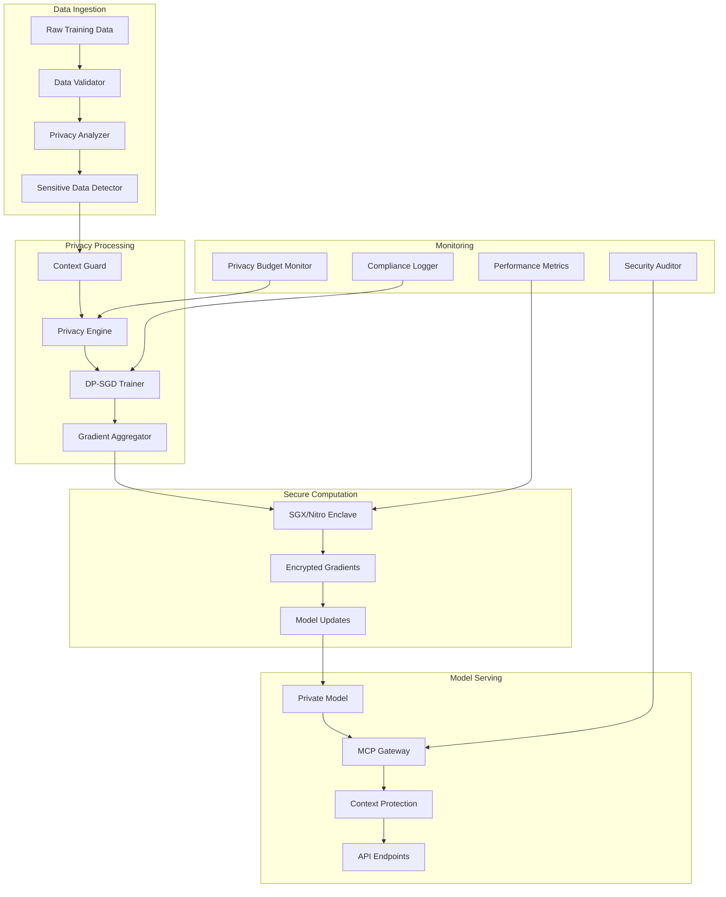

# Privacy-Preserving Agent Finetuner Architecture

## System Overview

The Privacy-Preserving Agent Finetuner is designed as a modular, enterprise-grade framework for fine-tuning large language models while maintaining strict privacy guarantees through differential privacy and secure computation.

## Core Components

### 1. Privacy Engine (`privacy_engine/`)
- **DP-SGD Trainer**: Implements differentially private stochastic gradient descent
- **Privacy Accountant**: Tracks privacy budget consumption using RDP/GDP accounting
- **Noise Generator**: Calibrated noise injection for gradient perturbation
- **Budget Monitor**: Real-time privacy budget tracking and alerts

### 2. Context Protection (`context_guard/`)
- **PII Redactor**: Removes personally identifiable information
- **Entity Hasher**: Consistent entity replacement with cryptographic hashes
- **Semantic Encryptor**: Preserves structure while encrypting meaning
- **K-Anonymizer**: Ensures k-anonymity in model outputs

### 3. Federated Learning (`federated/`)
- **Secure Aggregation**: Privacy-preserving gradient aggregation
- **Client Manager**: Handles federated learning participants
- **Communication Protocol**: Secure messaging between participants
- **Consensus Mechanism**: Byzantine-fault-tolerant aggregation

### 4. Hardware Security Integration (`secure_compute/`)
- **SGX Enclave Manager**: Intel SGX trusted execution environment
- **Nitro Enclave Interface**: AWS Nitro Enclaves integration
- **Attestation Service**: Remote attestation verification
- **Key Management**: Hardware security module integration

### 5. Model Context Protocol Gateway (`mcp_gateway/`)
- **Protocol Handler**: MCP message routing and validation
- **Privacy Filter**: Context protection before model inference
- **Rate Limiter**: API throttling and quota management
- **Audit Logger**: Comprehensive request/response logging

## Data Flow Architecture



## Security Architecture

### Trust Boundaries
1. **User Data Zone**: Raw sensitive data, never leaves trust boundary
2. **Processing Zone**: DP-SGD training within secure enclaves
3. **Model Zone**: Private models with privacy guarantees
4. **Public Zone**: Inference API with context protection

### Security Controls
- **Encryption**: AES-256 for data at rest, TLS 1.3 for data in transit
- **Authentication**: OAUTH2/OIDC with multi-factor authentication
- **Authorization**: RBAC with principle of least privilege
- **Attestation**: Remote attestation for secure enclave verification
- **Audit**: Comprehensive logging of all privacy-sensitive operations

## Privacy Guarantees

### Differential Privacy Parameters
- **ε (Epsilon)**: Privacy loss parameter (configurable: 0.1-10.0)
- **δ (Delta)**: Failure probability (typically 1e-5 to 1e-8)
- **Composition**: Privacy budget tracking across training epochs
- **Accounting**: RDP (Rényi Differential Privacy) or GDP (Gaussian DP) modes

### Privacy Mechanisms
1. **Gradient Clipping**: L2 norm clipping with adaptive thresholds
2. **Noise Addition**: Calibrated Gaussian noise based on sensitivity
3. **Privacy Amplification**: Subsampling for improved privacy bounds
4. **Post-processing**: Privacy-preserving model aggregation

## Deployment Architecture

### Container Architecture
```yaml
services:
  privacy-trainer:
    image: privacy-finetuner:latest
    environment:
      - PRIVACY_EPSILON=1.0
      - SECURE_COMPUTE=aws_nitro
    volumes:
      - ./config:/app/config
      - ./models:/app/models
    
  mcp-gateway:
    image: mcp-gateway:latest
    depends_on:
      - privacy-trainer
    ports:
      - "8080:8080"
    
  redis:
    image: redis:7-alpine
    volumes:
      - redis_data:/data
    
  monitoring:
    image: prometheus:latest
    volumes:
      - ./monitoring:/etc/prometheus
```

### Kubernetes Deployment
- **Pod Security Policy**: Enforce security standards
- **Network Policies**: Micro-segmentation for components
- **Service Mesh**: Istio for secure service-to-service communication
- **Secrets Management**: External secrets operator integration

## Performance Characteristics

### Scalability
- **Horizontal**: Multi-GPU training with data parallelism
- **Vertical**: Memory-efficient gradient checkpointing
- **Federated**: Supports 100+ federated learning clients
- **Throughput**: 10K-50K tokens/second with privacy guarantees

### Resource Requirements
- **CPU**: 8+ cores for privacy computations
- **Memory**: 16GB+ for model weights and gradient storage
- **GPU**: V100/A100 for accelerated training
- **Storage**: SSD recommended for model checkpoints

## Compliance and Auditing

### Regulatory Compliance
- **GDPR**: Right to erasure, data minimization
- **HIPAA**: Healthcare data protection requirements
- **EU AI Act**: High-risk AI system requirements
- **SOX**: Financial data protection standards

### Audit Trail
- **Training Logs**: Complete record of privacy budget consumption
- **Model Provenance**: Cryptographic proof of model training
- **Data Lineage**: Track data flow through privacy mechanisms
- **Compliance Reports**: Automated regulatory compliance verification

## Integration Points

### External Systems
- **Data Sources**: S3, GCS, Azure Blob, HDFS
- **Model Registry**: MLflow, Weights & Biases, Neptune
- **Monitoring**: Prometheus, Grafana, DataDog
- **Alerting**: PagerDuty, Slack, Microsoft Teams

### API Interfaces
- **REST API**: Standard HTTP endpoints for model operations
- **GraphQL**: Flexible query interface for metadata
- **gRPC**: High-performance streaming for training data
- **WebSocket**: Real-time privacy budget monitoring

## Future Enhancements

### Planned Features
- **Homomorphic Encryption**: Enable computation on encrypted data
- **Secure Multi-party Computation**: Joint training without data sharing
- **Zero-knowledge Proofs**: Verify privacy guarantees without revealing data
- **Quantum-resistant Cryptography**: Post-quantum security measures

### Research Integration
- **Privacy-preserving Transformers**: Specialized architectures for private training
- **Federated Learning Optimization**: Advanced aggregation algorithms
- **Privacy Budget Optimization**: Automated epsilon allocation strategies
- **Continual Learning**: Lifelong learning with privacy preservation