# Architecture Deep Dive

## 🏗️ Privacy-Preserving Agent Finetuner - Technical Architecture

This document provides a comprehensive technical deep-dive into the architecture, design patterns, component interactions, and implementation details of the privacy-preserving ML framework across all generations.

## 📋 Table of Contents

- [System Overview](#system-overview)
- [Core Architecture Principles](#core-architecture-principles)
- [Layer-by-Layer Architecture](#layer-by-layer-architecture)
- [Component Interaction Diagrams](#component-interaction-diagrams)
- [Data Flow Architecture](#data-flow-architecture)
- [Security Architecture](#security-architecture)
- [Scalability Architecture](#scalability-architecture)
- [Privacy Framework Design](#privacy-framework-design)
- [Integration Patterns](#integration-patterns)
- [Performance Optimizations](#performance-optimizations)

---

## 🎯 System Overview

The Privacy-Preserving Agent Finetuner is designed as a **multi-layered, modular architecture** that progressively enhances privacy-preserving machine learning capabilities through four distinct generations plus quality gates and global-first implementations.

### High-Level Architecture


---

## 🎨 Core Architecture Principles

### 1. **Privacy-First Design**
- **Principle**: Privacy is not an add-on but a fundamental architectural constraint
- **Implementation**: 
  - Differential privacy integrated at the tensor operation level
  - Privacy budget tracked across all computational paths
  - Cryptographic guarantees built into core data structures
  - Zero-knowledge proofs for model verification

### 2. **Modular Composition**
- **Principle**: Each generation adds capabilities without breaking existing functionality
- **Implementation**:
  - Interface-based design with dependency injection
  - Plugin architecture for extensible components
  - Backward compatibility guarantees
  - Graceful degradation when optional components unavailable

### 3. **Security by Design**
- **Principle**: Security threats are detected and mitigated at architectural level
- **Implementation**:
  - Real-time threat monitoring integrated into all components
  - Automated response systems with privacy preservation
  - Multi-layer security validation
  - Cryptographic isolation of sensitive operations

### 4. **Global Scalability**
- **Principle**: Architecture scales from single machine to global deployment
- **Implementation**:
  - Microservices architecture with container orchestration
  - Distributed computing with privacy-aware coordination
  - Multi-region deployment with compliance enforcement
  - Adaptive resource management

### 5. **Quality Assurance**
- **Principle**: Quality is continuously validated through automated testing
- **Implementation**:
  - Continuous integration of privacy guarantee validation
  - Performance regression testing
  - Security vulnerability scanning
  - Compliance verification automation

---

## 🏛️ Layer-by-Layer Architecture

### Core Framework Layer (Foundation)

The foundation layer provides the essential privacy-preserving ML capabilities.

```python
# Core Framework Architecture
class CoreFramework:
    """
    Foundation architecture providing essential privacy-preserving capabilities.
    """
    
    def __init__(self):
        self.privacy_engine = PrivacyEngine()
        self.model_manager = ModelManager()
        self.data_protection = DataProtectionLayer()
        self.crypto_provider = CryptographicProvider()
        
    # Component interaction patterns
    def train_with_privacy(self, model, dataset, config):
        # Privacy budget allocation
        budget = self.privacy_engine.allocate_budget(config.epsilon, config.delta)
        
        # Data protection
        protected_data = self.data_protection.protect_dataset(dataset, budget)
        
        # Cryptographic model operations
        encrypted_gradients = self.crypto_provider.encrypt_gradients()
        
        # Training with privacy guarantees
        result = self.model_manager.train_with_dp(
            model, protected_data, encrypted_gradients
        )
        
        return result
```

#### Key Components:

1. **PrivateTrainer**: Core training orchestration
2. **PrivacyConfig**: Privacy parameter management
3. **ContextGuard**: Context window protection
4. **ValidationEngine**: Privacy guarantee validation

#### Design Patterns:
- **Strategy Pattern**: For different privacy mechanisms (DP-SGD, LDP, etc.)
- **Observer Pattern**: For privacy budget monitoring
- **Factory Pattern**: For model instantiation with privacy constraints
- **Decorator Pattern**: For adding privacy protections to existing models

### Generation 1: Research Layer

Advanced algorithmic research capabilities built on the foundation.

```python
# Research Layer Architecture
class ResearchLayer:
    """
    Advanced algorithmic research and novel privacy-preserving techniques.
    """
    
    def __init__(self, core_framework):
        self.core = core_framework
        self.algorithm_registry = AlgorithmRegistry()
        self.experiment_manager = ExperimentManager()
        self.benchmark_engine = BenchmarkEngine()
        
    # Novel algorithm integration
    def register_algorithm(self, algorithm_class, metadata):
        self.algorithm_registry.register(algorithm_class, metadata)
        
    def run_research_experiment(self, experiment_config):
        # Setup experimental environment
        environment = self.experiment_manager.create_environment(experiment_config)
        
        # Run algorithms with privacy guarantees
        results = []
        for algorithm in self.algorithm_registry.get_algorithms():
            result = algorithm.run_experiment(
                environment, 
                privacy_constraints=experiment_config.privacy_constraints
            )
            results.append(result)
            
        # Benchmark comparison
        benchmark_result = self.benchmark_engine.compare_algorithms(
            results, 
            metrics=["privacy_utility", "performance", "robustness"]
        )
        
        return benchmark_result
```

#### Architectural Innovations:

1. **Adaptive Privacy Budget Allocation**
   ```python
   class AdaptiveBudgetAllocator:
       def allocate_budget(self, data_sensitivity, total_budget):
           # Dynamic allocation based on data sensitivity analysis
           allocation = self.sensitivity_analyzer.analyze(data_sensitivity)
           return self.optimizer.optimize_allocation(allocation, total_budget)
   ```

2. **Hybrid Privacy Mechanisms**
   ```python
   class HybridPrivacyMechanism:
       def __init__(self):
           self.mechanisms = [
               DifferentialPrivacyMechanism(),
               KAnonymityMechanism(), 
               HomomorphicEncryptionMechanism()
           ]
           
       def apply_hybrid_protection(self, data, weights):
           protected_data = data
           for mechanism, weight in zip(self.mechanisms, weights):
               protected_data = mechanism.apply_protection(
                   protected_data, weight
               )
           return protected_data
   ```

### Generation 2: Security Layer

Enterprise-grade security monitoring and resilience.

```python
# Security Layer Architecture
class SecurityLayer:
    """
    Real-time threat detection, security monitoring, and failure recovery.
    """
    
    def __init__(self, research_layer):
        self.research = research_layer
        self.threat_detection = ThreatDetectionEngine()
        self.security_orchestrator = SecurityOrchestrator()
        self.incident_response = IncidentResponseSystem()
        self.recovery_manager = RecoveryManager()
        
    def monitor_training_security(self, training_session):
        # Real-time threat monitoring
        self.threat_detection.start_monitoring(training_session)
        
        # Security event processing
        def handle_security_event(event):
            # Classify threat
            threat_classification = self.security_orchestrator.classify_threat(event)
            
            # Automated response
            if threat_classification.severity == "critical":
                self.incident_response.trigger_emergency_response(event)
                
            # Recovery if needed
            if threat_classification.requires_recovery:
                self.recovery_manager.initiate_recovery(
                    training_session, threat_classification
                )
                
        self.threat_detection.register_handler(handle_security_event)
```

#### Security Architecture Components:

1. **Multi-Layer Threat Detection**
   ```mermaid
   graph TD
       A[Training Metrics] --> B[Threat Detection Engine]
       C[System Metrics] --> B
       D[User Behavior] --> B
       E[Network Traffic] --> B
       
       B --> F[Pattern Analysis]
       B --> G[Anomaly Detection]
       B --> H[Statistical Analysis]
       
       F --> I[Threat Classification]
       G --> I
       H --> I
       
       I --> J[Response Orchestration]
       J --> K[Automated Mitigation]
       J --> L[Human Escalation]
       J --> M[Recovery Initiation]
   ```

2. **Privacy-Aware Recovery System**
   ```python
   class PrivacyAwareRecovery:
       def create_recovery_point(self, model_state, privacy_state):
           # Encrypt sensitive states
           encrypted_model = self.crypto.encrypt_model_state(model_state)
           encrypted_privacy = self.crypto.encrypt_privacy_state(privacy_state)
           
           # Create tamper-proof checkpoint
           checkpoint = CheckPoint(
               model_state=encrypted_model,
               privacy_state=encrypted_privacy,
               integrity_hash=self.crypto.compute_hash(
                   encrypted_model + encrypted_privacy
               ),
               timestamp=time.time()
           )
           
           return self.storage.store_checkpoint(checkpoint)
   ```

### Generation 3: Scaling Layer

Intelligent performance optimization and auto-scaling.

```python
# Scaling Layer Architecture  
class ScalingLayer:
    """
    Performance optimization, auto-scaling, and resource management.
    """
    
    def __init__(self, security_layer):
        self.security = security_layer
        self.performance_optimizer = PerformanceOptimizer()
        self.auto_scaler = AutoScaler()
        self.resource_manager = ResourceManager()
        self.cost_optimizer = CostOptimizer()
        
    def optimize_training_performance(self, training_workload):
        # Performance analysis
        performance_profile = self.performance_optimizer.analyze_workload(
            training_workload
        )
        
        # Resource optimization
        optimal_resources = self.resource_manager.calculate_optimal_allocation(
            performance_profile, 
            privacy_constraints=training_workload.privacy_requirements
        )
        
        # Auto-scaling decisions
        scaling_decision = self.auto_scaler.make_scaling_decision(
            current_resources=self.resource_manager.get_current_allocation(),
            optimal_resources=optimal_resources,
            cost_constraints=training_workload.cost_constraints
        )
        
        # Execute optimization
        if scaling_decision.should_scale:
            return self.execute_scaling_operation(scaling_decision)
            
        return self.apply_performance_optimizations(optimal_resources)
```

#### Scaling Architecture Patterns:

1. **Multi-Dimensional Scaling**
   ```mermaid
   graph LR
       A[Workload Analysis] --> B[Performance Profiling]
       B --> C[Resource Calculation]
       C --> D[Scaling Decision Engine]
       
       D --> E[Horizontal Scaling]
       D --> F[Vertical Scaling]
       D --> G[Performance Tuning]
       
       E --> H[Node Management]
       F --> I[Resource Allocation]
       G --> J[Optimization Engine]
       
       H --> K[Privacy-Aware Coordination]
       I --> K
       J --> K
   ```

2. **Cost-Aware Resource Management**
   ```python
   class CostAwareResourceManager:
       def optimize_cost_performance(self, workload, budget_constraints):
           # Analyze cost-performance tradeoffs
           pareto_frontier = self.calculate_pareto_optimal_configurations(
               workload, budget_constraints
           )
           
           # Select optimal configuration
           optimal_config = self.select_configuration(
               pareto_frontier,
               preferences={"cost_weight": 0.3, "performance_weight": 0.7}
           )
           
           return optimal_config
   ```

---

## 🔄 Component Interaction Diagrams

### Privacy-Preserving Training Flow


### Threat Detection and Response Flow


### Auto-Scaling Decision Flow


---

## 📊 Data Flow Architecture

### Training Data Pipeline


### Model State Management

```python
class ModelStateManager:
    """
    Manages model states with privacy preservation and security guarantees.
    """
    
    def __init__(self):
        self.encryption_manager = EncryptionManager()
        self.integrity_validator = IntegrityValidator()
        self.privacy_tracker = PrivacyTracker()
        
    def save_model_state(self, model, privacy_state, metadata):
        # Create comprehensive state snapshot
        state_snapshot = ModelStateSnapshot(
            model_parameters=model.state_dict(),
            privacy_spent=privacy_state.epsilon_spent,
            privacy_remaining=privacy_state.epsilon_remaining,
            training_metadata=metadata,
            timestamp=time.time()
        )
        
        # Encrypt sensitive information
        encrypted_snapshot = self.encryption_manager.encrypt_state(state_snapshot)
        
        # Add integrity protection
        integrity_hash = self.integrity_validator.compute_hash(encrypted_snapshot)
        
        # Privacy tracking
        self.privacy_tracker.track_state_save(privacy_state)
        
        # Store with redundancy
        storage_result = self.storage.store_with_replication(
            encrypted_snapshot, 
            integrity_hash,
            replication_factor=3
        )
        
        return storage_result
```

---

## 🔒 Security Architecture

### Defense in Depth Strategy

The security architecture implements multiple layers of protection:


### Cryptographic Architecture

```python
class CryptographicArchitecture:
    """
    Comprehensive cryptographic protection for privacy-preserving ML.
    """
    
    def __init__(self):
        # Multiple encryption layers
        self.symmetric_crypto = AESEncryption(key_size=256)
        self.asymmetric_crypto = RSAEncryption(key_size=4096)
        self.homomorphic_crypto = HomomorphicEncryption()
        self.secure_multiparty = SecureMultipartyComputation()
        
        # Key management
        self.key_manager = HierarchicalKeyManager()
        self.key_rotation = AutomaticKeyRotation(interval=86400)  # 24 hours
        
    def encrypt_training_data(self, data, privacy_level="high"):
        """Multi-layer encryption for training data."""
        if privacy_level == "high":
            # Homomorphic encryption for computation on encrypted data
            encrypted_data = self.homomorphic_crypto.encrypt(data)
        else:
            # Standard AES encryption
            encrypted_data = self.symmetric_crypto.encrypt(data)
            
        return encrypted_data
        
    def secure_gradient_aggregation(self, gradients_from_nodes):
        """Secure aggregation using multi-party computation."""
        aggregated_gradients = self.secure_multiparty.secure_sum(
            gradients_from_nodes,
            privacy_preserving=True
        )
        return aggregated_gradients
```

---

## ⚡ Scalability Architecture

### Horizontal Scaling Architecture


### Distributed Training Architecture

```python
class DistributedTrainingArchitecture:
    """
    Privacy-preserving distributed training with automatic scaling.
    """
    
    def __init__(self):
        self.parameter_server = ParameterServerCluster()
        self.worker_pool = WorkerNodePool()
        self.privacy_coordinator = DistributedPrivacyCoordinator()
        self.communication_manager = SecureCommunicationManager()
        
    def setup_distributed_training(self, model, privacy_config, num_workers):
        # Initialize parameter servers with privacy protection
        self.parameter_server.initialize_with_privacy(
            model, 
            privacy_config,
            encryption_enabled=True
        )
        
        # Setup worker nodes with privacy constraints
        workers = []
        for i in range(num_workers):
            worker = PrivacyAwareWorker(
                worker_id=i,
                privacy_budget=privacy_config.epsilon / num_workers,
                communication_channel=self.communication_manager.create_channel(i)
            )
            workers.append(worker)
            
        self.worker_pool.add_workers(workers)
        
        # Coordinate privacy budget across workers
        self.privacy_coordinator.setup_distributed_privacy(
            workers, privacy_config
        )
        
        return DistributedTrainingSession(
            parameter_server=self.parameter_server,
            workers=self.worker_pool,
            privacy_coordinator=self.privacy_coordinator
        )
```

---

## 🔍 Privacy Framework Design

### Differential Privacy Implementation

The privacy framework is built around mathematically rigorous differential privacy guarantees:

```python
class DifferentialPrivacyFramework:
    """
    Comprehensive differential privacy implementation with advanced features.
    """
    
    def __init__(self, privacy_config):
        self.privacy_config = privacy_config
        self.privacy_accountant = PrivacyAccountant(privacy_config)
        self.noise_generator = SecureNoiseGenerator()
        self.gradient_clipper = AdaptiveGradientClipper()
        
    def apply_dp_sgd(self, model, batch, optimizer):
        """Apply DP-SGD with privacy tracking."""
        
        # Step 1: Compute per-sample gradients
        per_sample_gradients = self.compute_per_sample_gradients(model, batch)
        
        # Step 2: Clip gradients to bound sensitivity
        clipped_gradients = self.gradient_clipper.clip_gradients(
            per_sample_gradients,
            max_norm=self.privacy_config.max_grad_norm
        )
        
        # Step 3: Add calibrated Gaussian noise
        noise_scale = self.calculate_noise_scale(
            self.privacy_config.noise_multiplier,
            self.privacy_config.max_grad_norm
        )
        
        noisy_gradients = self.noise_generator.add_gaussian_noise(
            clipped_gradients, noise_scale
        )
        
        # Step 4: Update privacy accountant
        privacy_spent = self.privacy_accountant.update_privacy_spent(
            noise_scale=noise_scale,
            sample_rate=len(batch) / self.total_dataset_size,
            steps=1
        )
        
        # Step 5: Apply noisy gradients to model
        optimizer.step_with_gradients(noisy_gradients)
        
        return privacy_spent
        
    def validate_privacy_guarantees(self):
        """Mathematically validate privacy guarantees."""
        theoretical_epsilon = self.privacy_accountant.get_theoretical_epsilon()
        empirical_epsilon_bound = self.privacy_accountant.get_empirical_bound()
        
        return PrivacyValidationResult(
            theoretical_epsilon=theoretical_epsilon,
            empirical_bound=empirical_epsilon_bound,
            guarantee_satisfied=theoretical_epsilon <= self.privacy_config.epsilon
        )
```

### Privacy Budget Management


---

## 🔗 Integration Patterns

### Plugin Architecture

The framework uses a plugin architecture for extensibility:

```python
class PluginArchitecture:
    """
    Extensible plugin system for adding new privacy mechanisms, 
    optimization strategies, and integration capabilities.
    """
    
    def __init__(self):
        self.plugin_registry = PluginRegistry()
        self.plugin_manager = PluginManager()
        self.compatibility_checker = CompatibilityChecker()
        
    def register_privacy_plugin(self, plugin_class, metadata):
        """Register new privacy-preserving algorithm plugin."""
        
        # Validate plugin interface
        if not self.validate_privacy_plugin_interface(plugin_class):
            raise InvalidPluginError("Plugin does not implement required interface")
            
        # Check compatibility
        compatibility = self.compatibility_checker.check_compatibility(
            plugin_class, self.get_current_framework_version()
        )
        
        if not compatibility.is_compatible:
            raise IncompatiblePluginError(
                f"Plugin incompatible: {compatibility.issues}"
            )
            
        # Register plugin
        self.plugin_registry.register(
            plugin_type="privacy_mechanism",
            plugin_class=plugin_class,
            metadata=metadata
        )
        
    def load_plugin(self, plugin_name, configuration):
        """Dynamically load and configure plugin."""
        plugin_info = self.plugin_registry.get_plugin(plugin_name)
        
        # Instantiate plugin with security validation
        plugin_instance = self.plugin_manager.instantiate_plugin(
            plugin_info.plugin_class,
            configuration,
            security_context=self.get_security_context()
        )
        
        # Initialize plugin with framework integration
        plugin_instance.initialize(
            framework_api=self.get_framework_api(),
            privacy_constraints=self.get_privacy_constraints()
        )
        
        return plugin_instance
```

### API Integration Patterns

```python
class APIIntegrationPatterns:
    """
    Standardized patterns for integrating with external systems.
    """
    
    # Webhook Integration Pattern
    def setup_webhook_integration(self, webhook_config):
        """Setup webhook for external system notifications."""
        webhook_handler = WebhookHandler(webhook_config)
        
        # Register privacy-aware webhook events
        self.event_manager.register_handler(
            event_type="privacy_budget_warning",
            handler=webhook_handler.send_privacy_alert
        )
        
        self.event_manager.register_handler(
            event_type="training_complete", 
            handler=webhook_handler.send_training_results
        )
        
    # Message Queue Integration Pattern
    def setup_message_queue_integration(self, queue_config):
        """Setup message queue for asynchronous processing."""
        message_queue = MessageQueueClient(queue_config)
        
        # Privacy-aware message serialization
        privacy_serializer = PrivacyAwareSerializer()
        
        # Setup message handlers with privacy protection
        message_queue.register_handler(
            topic="training_requests",
            handler=self.handle_training_request,
            serializer=privacy_serializer
        )
        
    # Database Integration Pattern
    def setup_database_integration(self, db_config):
        """Setup database with privacy-preserving queries."""
        database = PrivacyAwareDatabase(db_config)
        
        # Configure privacy-preserving query engine
        query_engine = database.get_query_engine()
        query_engine.enable_differential_privacy(epsilon=1.0)
        
        return database
```

---

## 🚀 Performance Optimizations

### Memory Optimization Architecture

```python
class MemoryOptimizationArchitecture:
    """
    Advanced memory optimization for privacy-preserving training.
    """
    
    def __init__(self):
        self.memory_profiler = MemoryProfiler()
        self.gradient_compression = GradientCompression()
        self.model_sharding = ModelSharding()
        self.memory_pool = PrivacyAwareMemoryPool()
        
    def optimize_memory_usage(self, model, training_config):
        # Profile current memory usage
        memory_profile = self.memory_profiler.profile_training(
            model, training_config
        )
        
        optimizations = []
        
        # Gradient compression for communication efficiency
        if memory_profile.gradient_memory_high:
            compression_strategy = self.gradient_compression.select_strategy(
                privacy_constraints=training_config.privacy_config,
                compression_ratio=0.1
            )
            optimizations.append(compression_strategy)
            
        # Model sharding for large models
        if memory_profile.model_memory_high:
            sharding_strategy = self.model_sharding.create_sharding_plan(
                model, 
                privacy_preserving=True,
                shard_count=4
            )
            optimizations.append(sharding_strategy)
            
        # Privacy-aware memory pooling
        memory_pool_strategy = self.memory_pool.create_pooling_strategy(
            memory_profile,
            privacy_requirements=training_config.privacy_config
        )
        optimizations.append(memory_pool_strategy)
        
        return MemoryOptimizationPlan(optimizations)
```

### Computation Optimization Architecture

```mermaid
graph LR
    subgraph "🧠 Computation Pipeline"
        A[Input Processing] --> B[Privacy Protection]
        B --> C[Model Computation]
        C --> D[Gradient Computation]
        D --> E[Privacy Accounting]
        E --> F[Output Generation]
    end
    
    subgraph "⚡ Optimization Layer"
        G[Tensor Fusion]
        H[Kernel Optimization]
        I[Memory Reuse]
        J[Parallel Processing]
    end
    
    subgraph "🔧 Hardware Acceleration"
        K[GPU Acceleration]
        L[TPU Optimization]
        M[Distributed Computing]
        N[FPGA Integration]
    end
    
    B --> G
    C --> H
    D --> I
    E --> J
    
    G --> K
    H --> L
    I --> M
    J --> N
```



---

## 📋 Summary

This architecture deep-dive reveals a sophisticated, multi-layered system designed for:

### ✅ **Architectural Strengths**
- **Privacy-First**: Mathematical guarantees built into every layer
- **Security-Hardened**: Multi-layer defense with real-time threat detection
- **Scalable**: Distributed architecture with intelligent auto-scaling
- **Extensible**: Plugin architecture for new privacy mechanisms
- **Production-Ready**: Enterprise-grade reliability and monitoring

### 🎯 **Key Design Decisions**
- **Modular Composition**: Each generation adds capabilities without breaking compatibility
- **Defense in Depth**: Multiple security layers with automated response
- **Privacy by Design**: DP guarantees integrated at tensor operation level
- **Global Scalability**: Multi-region deployment with compliance enforcement
- **Quality Assurance**: Continuous validation of privacy and security guarantees

### 🚀 **Innovation Highlights**
- **Adaptive Privacy Budget Allocation**: Dynamic privacy management based on data sensitivity
- **Hybrid Privacy Mechanisms**: Combination of DP, K-anonymity, and homomorphic encryption
- **Privacy-Aware Auto-Scaling**: Resource scaling that respects privacy constraints
- **Real-Time Threat Detection**: ML-powered security monitoring with automated response
- **Global Compliance Management**: Automated multi-jurisdiction privacy law compliance

This architecture provides the foundation for secure, scalable, and privacy-preserving machine learning at enterprise scale while maintaining mathematical rigor in privacy guarantees and operational excellence in deployment.