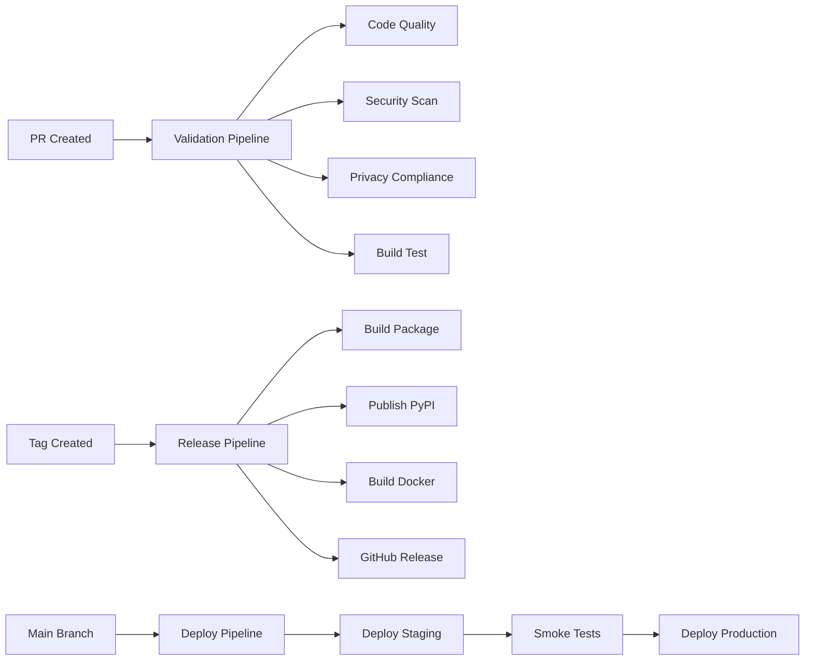

# Repository Setup Guide for Maintainers

## Overview

This guide provides step-by-step instructions for repository maintainers to complete the SDLC automation setup. Due to GitHub App permission limitations, certain components require manual configuration.

## 🚨 Critical: Manual Setup Required

The following components **MUST** be manually created by repository maintainers with appropriate permissions:

### 1. GitHub Actions Workflows

Copy the workflow files from `docs/workflows/examples/` to `.github/workflows/`:

```bash
mkdir -p .github/workflows
cp docs/workflows/examples/*.yml .github/workflows/
```

**Required Workflows:**
- `pr-validation.yml` - Pull request validation and testing
- `release.yml` - Automated release and publishing
- `deploy.yml` - Deployment automation
- `security-monitoring.yml` - Security scanning and compliance

### 2. Repository Settings Configuration

#### Branch Protection Rules
Configure branch protection for `main` branch:

1. Go to **Settings → Branches → Add Rule**
2. Branch name pattern: `main`
3. Enable the following:
   - ✅ Require a pull request before merging
   - ✅ Require approvals (minimum: 2)
   - ✅ Dismiss stale PR approvals when new commits are pushed
   - ✅ Require review from code owners
   - ✅ Require status checks to pass before merging
   - ✅ Require branches to be up to date before merging
   - ✅ Require signed commits
   - ✅ Include administrators

#### Required Status Checks
Add these status checks (after workflows are created):
- `code-quality`
- `security-scan`
- `privacy-compliance`
- `build-test`

### 3. Repository Secrets Configuration

#### General Secrets
```bash
# Package publishing
PYPI_TOKEN=<pypi-api-token>
DOCKERHUB_USERNAME=<username>
DOCKERHUB_TOKEN=<access-token>

# Code coverage and analysis
CODECOV_TOKEN=<codecov-token>
SONARCLOUD_TOKEN=<sonar-token>

# Security scanning
NVD_API_KEY=<nvd-api-key>
FOSSA_API_KEY=<fossa-api-key>
GITLEAKS_LICENSE=<gitleaks-license>
```

#### AWS Deployment Secrets
```bash
AWS_ACCESS_KEY_ID=<aws-access-key>
AWS_SECRET_ACCESS_KEY=<aws-secret-key>
PRODUCTION_LISTENER_ARN=<arn>
GREEN_TARGET_GROUP_ARN=<arn>
BLUE_TARGET_GROUP_ARN=<arn>
```

#### Monitoring and Alerting
```bash
SLACK_WEBHOOK_URL=<slack-webhook>
SECURITY_SLACK_WEBHOOK_URL=<security-slack-webhook>
SENTRY_DSN=<sentry-dsn>
DATADOG_API_KEY=<datadog-key>
```

### 4. Environment Configuration

#### Staging Environment
1. Go to **Settings → Environments → New Environment**
2. Name: `staging`
3. Configure:
   - Required reviewers: 1 person
   - Deployment protection rules: None
   - Environment secrets:
     ```
     DATABASE_URL=<staging-db-url>
     REDIS_URL=<staging-redis-url>
     PRIVACY_CONFIG=<staging-privacy-config>
     ```

#### Production Environment
1. Go to **Settings → Environments → New Environment**
2. Name: `production`
3. Configure:
   - Required reviewers: 2 people
   - Deployment protection rules: Wait timer (10 minutes)
   - Environment secrets:
     ```
     DATABASE_URL=<production-db-url>
     REDIS_URL=<production-redis-url>
     PRIVACY_CONFIG=<production-privacy-config>
     MONITORING_API_KEY=<monitoring-key>
     ```

## 🔧 Development Environment Setup

### Prerequisites
- Python 3.9+
- Poetry
- Docker
- Git

### Local Development Setup
```bash
# Clone repository
git clone <repository-url>
cd privacy-preserving-agent-finetuner

# Setup development environment
make setup-dev

# Install pre-commit hooks
pre-commit install

# Run quality checks
make check

# Run tests
make test

# Build package
make build
```

### Docker Development
```bash
# Build development image
docker-compose build

# Start development environment
docker-compose up -d

# Run tests in container
docker-compose exec app pytest
```

## 🏗️ CI/CD Pipeline Configuration

### Pipeline Overview


### Workflow Triggers
- **PR Validation**: On pull request to `main` or `develop`
- **Release**: On tag push (`v*`)
- **Deploy**: On push to `main` or manual trigger
- **Security**: Daily at 2 AM UTC or on dependency changes

## 📊 Monitoring and Observability

### Required Monitoring Stack
1. **Prometheus**: Metrics collection
2. **Grafana**: Visualization dashboards
3. **Alertmanager**: Alert routing
4. **Sentry**: Error tracking
5. **Datadog**: APM and infrastructure monitoring

### Dashboard Setup
Import the provided Grafana dashboard:
```bash
# Import dashboard
curl -X POST \
  http://grafana:3000/api/dashboards/db \
  -H 'Content-Type: application/json' \
  -d @monitoring/grafana/dashboards/privacy-finetuner-dashboard.json
```

### Alert Configuration
Deploy alert rules:
```bash
# Apply Prometheus alert rules
kubectl apply -f monitoring/alert_rules.yml
```

## 🔒 Security Configuration

### Security Scanning Schedule
- **Daily**: Dependency and vulnerability scans
- **Weekly**: Container security scans
- **Monthly**: Comprehensive security audit
- **On-demand**: Manual security reviews

### Security Team Setup
1. Create security team: `@terragon-labs/security-team`
2. Add security team members
3. Configure security notifications
4. Setup incident response procedures

## 🛡️ Privacy Compliance

### Privacy Team Setup
1. Create privacy team: `@terragon-labs/privacy-team`
2. Configure privacy review requirements
3. Setup privacy budget monitoring
4. Implement privacy incident response

### Compliance Automation
The repository includes automated compliance checks:
```bash
# Run privacy compliance check
python scripts/privacy_compliance_check.py

# Run privacy tests
pytest tests/ -m privacy
```

## 📋 Team Structure and Permissions

### Required Teams
Create the following GitHub teams:

#### Core Teams
- `@terragon-labs/core-team` - Core maintainers
- `@terragon-labs/architecture-team` - Architecture decisions
- `@terragon-labs/qa-team` - Quality assurance

#### Specialized Teams
- `@terragon-labs/privacy-team` - Privacy engineering
- `@terragon-labs/security-team` - Security engineering
- `@terragon-labs/devops-team` - DevOps and infrastructure
- `@terragon-labs/sre-team` - Site reliability engineering

#### Support Teams
- `@terragon-labs/docs-team` - Documentation
- `@terragon-labs/legal-team` - Legal and compliance

### Permission Matrix
| Team | Repository | Admin | Maintain | Triage | Write | Read |
|------|------------|-------|----------|--------|-------|------|
| core-team | ✅ | ✅ | ✅ | ✅ | ✅ | ✅ |
| security-team | ❌ | ❌ | ✅ | ✅ | ✅ | ✅ |
| privacy-team | ❌ | ❌ | ✅ | ✅ | ✅ | ✅ |
| devops-team | ❌ | ❌ | ✅ | ✅ | ✅ | ✅ |
| docs-team | ❌ | ❌ | ❌ | ✅ | ✅ | ✅ |

## 🚀 Deployment Configuration

### Infrastructure Requirements
- **Staging**: ECS cluster with 2 instances
- **Production**: ECS cluster with 5+ instances
- **Database**: RDS PostgreSQL with encryption
- **Cache**: ElastiCache Redis cluster
- **Load Balancer**: ALB with SSL termination
- **Storage**: S3 with encryption at rest

### Deployment Strategy
- **Staging**: Direct deployment on main branch
- **Production**: Blue-green deployment with manual approval

### Rollback Procedures
1. **Automated Rollback**: Triggered by health check failures
2. **Manual Rollback**: Emergency procedures documented
3. **Database Rollback**: Separate procedures for schema changes

## 📖 Documentation Requirements

### Mandatory Documentation
- [ ] Architecture Decision Records (ADRs)
- [ ] API documentation
- [ ] Privacy implementation guide
- [ ] Security procedures
- [ ] Incident response runbooks
- [ ] Deployment procedures

### Documentation Standards
- Use Markdown format
- Include code examples
- Maintain version history
- Regular review and updates

## ✅ Validation Checklist

### Pre-Launch Checklist
- [ ] All workflows created and tested
- [ ] Branch protection rules configured
- [ ] Required secrets added
- [ ] Environment configurations complete
- [ ] Team permissions configured
- [ ] Monitoring stack deployed
- [ ] Security scanning enabled
- [ ] Privacy compliance verified
- [ ] Documentation complete
- [ ] Team training completed

### Post-Launch Monitoring
- [ ] CI/CD pipelines functioning
- [ ] Deployments successful
- [ ] Monitoring alerts working
- [ ] Security scans passing
- [ ] Privacy compliance maintained
- [ ] Performance metrics healthy

## 🆘 Troubleshooting

### Common Issues

#### Workflow Failures
```bash
# Check workflow status
gh run list --workflow=pr-validation.yml

# View workflow logs
gh run view <run-id> --log
```

#### Permission Issues
- Verify team memberships
- Check repository permissions
- Review branch protection rules

#### Security Scan Failures
- Review security scan reports
- Update dependencies if needed
- Adjust security thresholds if appropriate

### Getting Help
- **General Issues**: Create issue with `help-wanted` label
- **Security Issues**: Follow security reporting procedures
- **Privacy Issues**: Contact privacy team directly
- **Infrastructure Issues**: Contact DevOps team

## 📞 Contacts

- **Security Team**: security@terragon-labs.com
- **Privacy Team**: privacy@terragon-labs.com
- **DevOps Team**: devops@terragon-labs.com
- **Emergency Contact**: emergency@terragon-labs.com

---

**Note**: This setup guide must be followed completely to ensure proper SDLC automation and security compliance. Regular reviews and updates are required to maintain effectiveness.