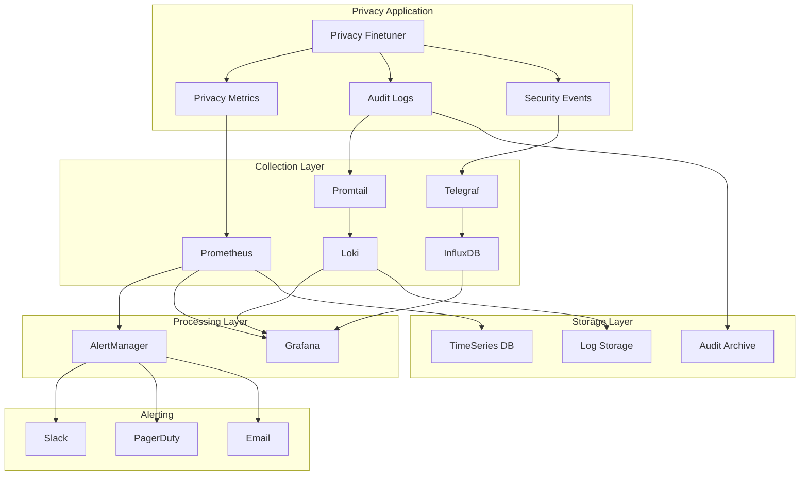

# Monitoring and Observability

Comprehensive monitoring and observability setup for the Privacy-Preserving Agent Fine-Tuner, with special focus on privacy-specific metrics and compliance monitoring.

## Overview

Our monitoring stack is designed with privacy-first principles:

- **Privacy Budget Monitoring**: Real-time tracking of ε and δ consumption
- **Compliance Monitoring**: GDPR, HIPAA, CCPA violation detection
- **Security Monitoring**: Privacy attack detection and anomaly monitoring
- **Performance Monitoring**: Training performance and resource utilization
- **Infrastructure Monitoring**: System health and container metrics

## Architecture



## Components

### Core Monitoring Stack

1. **Prometheus** - Metrics collection and alerting
2. **Grafana** - Visualization and dashboards
3. **Loki** - Log aggregation with privacy-aware parsing
4. **Promtail** - Log collection with PII scrubbing
5. **AlertManager** - Alert routing and notification
6. **Jaeger** - Distributed tracing

### Extended Stack

1. **InfluxDB** - High-frequency privacy metrics
2. **Telegraf** - System and application metrics
3. **ElasticSearch** - Audit log search and analysis
4. **Kibana** - Log visualization and analysis

### Privacy-Specific Components

1. **Privacy Budget Monitor** - Real-time ε/δ tracking
2. **Compliance Monitor** - Regulatory violation detection
3. **Attack Detector** - Privacy attack identification
4. **Audit Logger** - Comprehensive audit trail

## Quick Start

### Start Monitoring Stack

```bash
# Start full monitoring stack
docker-compose -f monitoring/docker-compose.monitoring.yml up -d

# Start with Make
make monitor

# Check status
docker-compose -f monitoring/docker-compose.monitoring.yml ps
```

### Access Dashboards

- **Grafana**: http://localhost:3000 (admin/admin)
- **Prometheus**: http://localhost:9090
- **AlertManager**: http://localhost:9093
- **Jaeger**: http://localhost:16686
- **Kibana**: http://localhost:5601
- **InfluxDB**: http://localhost:8086

### Default Credentials

| Service | Username | Password |
|---------|----------|----------|
| Grafana | admin | admin_change_me |
| InfluxDB | admin | admin_change_me |
| ElasticSearch | - | - |

**⚠️ Change default passwords in production!**

## Privacy Metrics

### Core Privacy Metrics

```prometheus
# Privacy budget consumption
privacy_budget_consumed_total{session_id, model_name}
privacy_budget_remaining{session_id, model_name}
privacy_epsilon_consumed{session_id}
privacy_delta_consumed{session_id}

# Differential privacy mechanisms
privacy_noise_magnitude{mechanism, step}
gradient_clipping_norm{step}
privacy_accounting_errors_total

# Training with privacy
training_steps_with_privacy_total
training_throughput_private{model_name}
privacy_overhead_ratio{operation}
```

### Security Metrics

```prometheus
# Attack detection
privacy_attack_score{attack_type, source_ip}
membership_inference_risk_score{model_name}
model_inversion_risk_score{model_name}

# Anomaly detection
security_anomalies_total{anomaly_type}
authentication_failures_total{source_ip}
unauthorized_access_attempts_total
```

### Compliance Metrics

```prometheus
# Regulatory compliance
gdpr_compliance_violations_total{violation_type}
hipaa_compliance_violations_total{violation_type}
data_retention_violations_total{policy}

# Data governance
pii_detection_score{data_source}
data_quality_score{dataset}
data_lineage_integrity{pipeline}
```

## Dashboards

### Privacy Budget Dashboard

Monitors privacy budget consumption in real-time:

- **Current Budget Status**: ε and δ consumption gauges
- **Budget Consumption Rate**: Trend over time
- **Budget Exhaustion Prediction**: Time to exhaustion
- **Per-Session Breakdown**: Budget usage by training session

### Security Dashboard

Monitors privacy and security threats:

- **Attack Detection**: Real-time attack scores
- **Anomaly Detection**: Behavioral anomalies
- **Failed Authentication**: Login attempt monitoring
- **Privacy Risk Assessment**: Ongoing risk evaluation

### Compliance Dashboard

Tracks regulatory compliance:

- **GDPR Compliance**: Data subject rights, consent management
- **HIPAA Compliance**: PHI protection, access controls
- **Data Governance**: Retention policies, data quality
- **Audit Trail**: Comprehensive activity logging

### Performance Dashboard

Monitors system and training performance:

- **Training Metrics**: Throughput, accuracy, loss
- **Privacy Overhead**: Performance impact of privacy mechanisms
- **Resource Utilization**: CPU, memory, GPU usage
- **Infrastructure Health**: Service availability, errors

## Alerting

### Critical Privacy Alerts

1. **Privacy Budget Exhausted** - Immediate privacy violation
2. **Privacy Attack Detected** - Potential security breach
3. **Compliance Violation** - Regulatory requirement breach
4. **Noise Generation Failure** - DP mechanism failure

### Warning Alerts

1. **Privacy Budget Low** - Approaching budget limits
2. **High Privacy Overhead** - Performance degradation
3. **Model Drift Detected** - Model quality issues
4. **Data Quality Issues** - Input data problems

### Alert Routing

```yaml
# Critical privacy alerts
severity: critical
category: privacy_violation
→ PagerDuty + Slack #privacy-critical

# Compliance violations
category: regulatory
→ Compliance Team + Legal

# Security alerts
category: security
→ Security Team + SOC

# Business hours routing
severity: warning
time: business_hours
→ Slack #privacy-alerts

# After hours routing
severity: warning
time: after_hours
→ Slack #privacy-alerts-after-hours
```

## Log Management

### Privacy-Aware Log Collection

Logs are processed to protect sensitive information:

1. **PII Scrubbing**: Automatic removal of personal data
2. **ID Hashing**: Consistent hashing of user identifiers
3. **Selective Retention**: Privacy-sensitive logs have shorter retention
4. **Access Controls**: Role-based access to different log types

### Log Categories

- **Application Logs**: Service operations and errors
- **Privacy Logs**: Privacy budget and mechanism operations
- **Audit Logs**: Security and compliance events
- **System Logs**: Infrastructure and container events

### Log Retention

| Log Type | Retention Period | Reason |
|----------|------------------|--------|
| Application | 30 days | Operational needs |
| Privacy | 7 days | Minimize privacy exposure |
| Audit | 7 years | Compliance requirements |
| System | 90 days | Infrastructure management |

## Security and Compliance

### Data Protection

1. **Encryption at Rest**: All metrics and logs encrypted
2. **Encryption in Transit**: TLS for all communications
3. **Access Controls**: RBAC for monitoring components
4. **Audit Logging**: All access to monitoring data logged

### Privacy Controls

1. **Data Minimization**: Only collect necessary metrics
2. **Anonymization**: Hash or remove PII from logs
3. **Retention Limits**: Automatic data deletion
4. **Access Restrictions**: Need-to-know access principles

### Compliance Features

1. **GDPR Compliance**: Data subject rights, consent tracking
2. **HIPAA Compliance**: PHI protection, audit trails
3. **SOC 2**: Security controls and monitoring
4. **ISO 27001**: Information security management

## Configuration

### Environment Variables

```bash
# Basic configuration
GRAFANA_ADMIN_PASSWORD=secure_password
INFLUXDB_ADMIN_PASSWORD=secure_password
INFLUXDB_ADMIN_TOKEN=secure_token

# Alert routing
SLACK_WEBHOOK_URL=https://hooks.slack.com/...
PAGERDUTY_SERVICE_KEY=your_pagerduty_key
PRIVACY_METRICS_TOKEN=privacy_metrics_token

# Privacy settings
PRIVACY_BUDGET_ALERT_THRESHOLD=0.8
PRIVACY_ATTACK_THRESHOLD=0.7
DATA_RETENTION_DAYS=7
```

### Custom Metrics

Add custom privacy metrics to your application:

```python
from prometheus_client import Counter, Gauge, Histogram

# Privacy budget tracking
privacy_budget_consumed = Gauge(
    'privacy_budget_consumed',
    'Current privacy budget consumed',
    ['session_id', 'model_name']
)

# Privacy mechanism metrics
noise_magnitude = Histogram(
    'privacy_noise_magnitude',
    'Magnitude of noise added for differential privacy',
    ['mechanism', 'step']
)

# Security metrics
attack_score = Gauge(
    'privacy_attack_score',
    'Current privacy attack risk score',
    ['attack_type', 'model_name']
)
```

### Custom Alerts

Add application-specific alerts:

```yaml
# Custom privacy alert
- alert: CustomPrivacyViolation
  expr: custom_privacy_metric > threshold
  for: 1m
  labels:
    severity: critical
    component: custom_component
  annotations:
    summary: "Custom privacy violation detected"
    description: "Custom privacy metric exceeded threshold"
```

## Troubleshooting

### Common Issues

1. **Metrics Not Appearing**
   ```bash
   # Check Prometheus targets
   curl http://localhost:9090/api/v1/targets
   
   # Check service discovery
   docker-compose logs prometheus
   ```

2. **Alerts Not Firing**
   ```bash
   # Check AlertManager config
   curl http://localhost:9093/api/v1/status
   
   # Test alert rules
   promtool query instant 'privacy_budget_remaining < 0.1'
   ```

3. **High Memory Usage**
   ```bash
   # Check retention settings
   # Reduce scrape intervals
   # Enable metric filtering
   ```

4. **Privacy Metrics Missing**
   ```bash
   # Check privacy metrics endpoint
   curl http://privacy-finetuner:8080/metrics/privacy
   
   # Verify privacy component health
   docker-compose logs privacy-finetuner
   ```

### Debug Commands

```bash
# Check all services
docker-compose -f monitoring/docker-compose.monitoring.yml ps

# View logs
docker-compose -f monitoring/docker-compose.monitoring.yml logs -f prometheus

# Test metric collection
curl -s http://localhost:9090/api/v1/query?query=up | jq

# Check alert status
curl -s http://localhost:9093/api/v1/alerts | jq

# Validate configurations
promtool check config monitoring/prometheus.yml
promtool check rules monitoring/alert_rules.yml
```

## Best Practices

### Monitoring

1. **Monitor Privacy First**: Privacy metrics are most critical
2. **Real-time Alerting**: Immediate notification for privacy violations
3. **Comprehensive Coverage**: Monitor all privacy-relevant components
4. **Regular Review**: Weekly review of privacy metrics and trends

### Security

1. **Secure by Default**: All monitoring components secured
2. **Minimal Exposure**: Only necessary metrics collected
3. **Regular Audits**: Monthly security review of monitoring setup
4. **Incident Response**: Clear procedures for privacy incidents

### Performance

1. **Efficient Collection**: Optimize scrape intervals and retention
2. **Selective Monitoring**: Focus on critical metrics
3. **Resource Limits**: Set appropriate resource constraints
4. **Regular Cleanup**: Automated cleanup of old data

## Contributing

When adding new monitoring features:

1. **Privacy First**: Ensure all new metrics respect privacy principles
2. **Comprehensive Testing**: Test all alert conditions
3. **Documentation**: Update dashboards and runbooks
4. **Security Review**: Security team review for new metrics
5. **Compliance Check**: Legal review for regulatory compliance

See [CONTRIBUTING.md](../../CONTRIBUTING.md) for detailed guidelines.

## Support

- **Documentation**: Full monitoring documentation
- **Runbooks**: Step-by-step incident response procedures
- **Training**: Regular training on privacy monitoring
- **Support Team**: 24/7 support for critical privacy alerts

For monitoring issues, contact: monitoring-support@privacy-finetuner.com
For privacy incidents, contact: privacy-incident@privacy-finetuner.com
